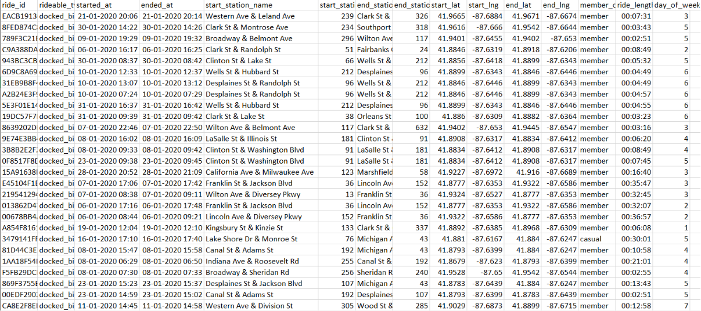
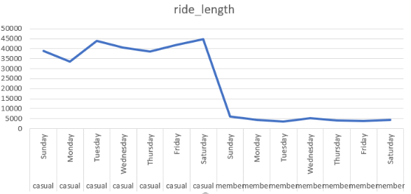

#  Cyclistic Bike-Share Analysis

## Project Overview
The project aims to convert casual riders into annual members by analyzing usage patterns. My role focuses on identifying how annual members and casual riders use bikes differently such as trip duration, frequency, and preferred times to uncover insights that can guide targeted strategies for increasing memberships.

## Objectives
- Clean and transform bike-share dataset using EXCEL
- Exploratory analysis using PHYTHON
- Line chart using excel for visualization

## Tools Used
- Excel 
- Python (pandas, numpy)  
- Jupyter Notebook for analysis

## Key Insights
- Casual riders → longer trips, often on weekends (leisure use).  
- Annual members → shorter trips, mainly on weekdays (commuting use).

## Data structure

## Visualization

## Project files
[trips_2019Q1](https://1drv.ms/f/c/5c548d342686c0f6/IgBTG0AU8eRwRZv_ahiCF5eAAYIn_JrrPAjLNUs6HNLQqA8?e=3q4J5G)
[trips_2020Q1](https://1drv.ms/f/c/5c548d342686c0f6/IgBTG0AU8eRwRZv_ahiCF5eAAYIn_JrrPAjLNUs6HNLQqA8)
[project report](https://1drv.ms/w/c/5c548d342686c0f6/IQCdJG_QxpnjTr392ydAzR5fAUn_SK2Wrx7p5JOY11DWBW8?e=MVZgG9)
   
